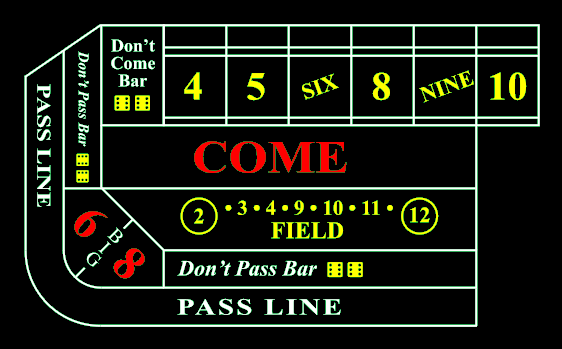

# Lecture 10: Probability Distributions
* __Coming Up__:
  * Lab 2 due on __September 22__
  * Exam 1 coming up on __September 23-24__

Resources for this lecture:

Remember:

## Probability Distributions
Probability of hair color: What percentage of people have red hair?

| Hair Color | Blonde | Black | Brown | White | Red   |
| :--------: | :----: | :---: | :---: | :---: | :---: |
| $P(x)$     | 0.05   | 0.75  | 0.15  | 0.01  | ??    |

How did we figure it out?

There are 3 rules for probability distributions
1. Different categories must be disjoint
2. Each probability must be between 0 and 1
3. The probability must total 1.0.

## Expectation
Can we find an average for a categorical variable? For a nominal variable, no. But for an ordinal variable, we can.

* Eqn for mean
$$\bar{x}=\frac{x_1+x_2+x_3+...}{n}$$
* Separate
$$\bar{x} = x_1\frac{1}{n} + x_2\frac{1}{n} + x_3\frac{1}{n} + ...$$
* The fraction 1/n is just the probability of randomly selecting $x_i$
$$\bar{x} = x_1P(x_1) + x_2P(x_2) + x_3P(x_3) + ...$$
$$E[X] = \bar{x} = \sum_i x_i P(x_i)\tag{Expected Value of Ordinal Variables}$$

This is the __expected value__ of event $$X$$. The mean calculation is just the expected value of a uniform distribution. However, it is possible for one value to be weighted more heavily, thus working with different probabilities.

To make this work on an ordinal variable, just assign a number to each category with the order of numbers representing the order of categories.

### Grade Level
| Category | Freshman | Sophomore | Junior | Senior  |
| :------: | :------: | :-------: | :----: | :-----: |
| $x$      |  1       |  2        |  3     |  4      |
| $P(x)$   |  0.45    |  0.40     |  0.10  | ?(0.05) |

> Have students calculate P(Senior), then calculate the expected value.
>
> $$E[X] = (1*0.45) + (2*0.40) + (3*0.10) + (4*0.05) = 1.75$$
>
> * This puts the average between Freshman and Sophomore, leaning toward Sophomore

What if we chose a different scale? 
* 0=Freshman, 1=Sophomore, 2=Junior, 3=Senior
  * $E[X] = (0*0.45) + (1*0.40) + (2*0.10) + (3*0.05) = 0.75$
  * The average is still between Freshman and Sophomore, leaning toward Sophomore
* 19=Freshman, 18=Sophomore, 17=Junior, 16=Senior
  * $E[X] = (19*0.45) + (18*0.40) + (17*0.10) + (16*0.05) = 18.25$
  * The average is still between Freshman and Sophomore, leaning toward Sophomore
* Starting with random numbers can confuse readers
  * Remember: Our goal is to make this as easy as possible for readers to understand
  * Best practice is to either start our categories with 0 or 1

### Gambling
Can we apply this to gambling?

The game of Craps has lots of types of bets. You roll 2 dice and your winnings (or losses) depend on the sum of the 2 dice

We'll focus on the field bet. What is the expected value for our winnings?

| Roll        | Winnings | Probability | x*P(x) |
| :---------: | :------: | :---------: | :----: |
| 3,4,9,10,11 | $1       | 14/36       | 14/36  |
| 2           | $2       | 1/36        | 2/36   |
| 12          | $3       | 1/36        | 3/36   |
| 5,6,7,8     | -$1      | 20/36       | -20/36 |

Rolls:

| Total | Rolls                               |
| :---: | :---------------------------------- |
|   2   | (1,1)                               |
|   3   | (1,2) (2,1)                         |
|   4   | (1,3) (2,2) (3,3)                   |
|   5   | (1,4) (2,3) (3,2) (4,1)             |
|   6   | (1,5) (2,4) (3,3) (4,2) (5,1)       |
|   7   | (1,6) (2,5) (3,4) (4,3) (5,2) (6,1) |
|   8   | (2,6) (3,5) (4,4) (5,3) (6,2)       |
|   9   | (3,6) (4,5) (5,4) (6,3)             |
|  10   | (4,6) (5,5) (6,4)                   |
|  11   | (5,6) (6,5)                         |
|  12   | (6,6)                               |

$$E[X]=\frac{14}{36}+\frac{2}{36}+\frac{3}{36}−\frac{20}{36} = \frac{−1}{36} = −0.027$$

### Life Insurance
Sometimes our categories have a natural value. Such is the case with insurance, where the value would be the worth of a policy compared to the cost.
* Look up insurance rates for your age
    * Insurance Rates: [https://www.nerdwallet.com/article/insurance/average-life-insurance-rates](https://www.nerdwallet.com/article/insurance/average-life-insurance-rates)
* Look up probability of living
    * Probability of living: [https://www.ssa.gov/oact/STATS/table4c6.html](https://www.ssa.gov/oact/STATS/table4c6.html)
* Calculate expected earnings for life insurance

|         | Live     | Die      |
| :-----: | :------: | :------: |
| *x*     | -$250    | $199,750 |
| *P(x)*  | 0.995    | 0.005    |
| *xP(x)* | -$248.75 | $998.75  |

$$E[X] = -$248.75 + $998.75 = $750$$

## Expected values of Functions
$$E[g(X)]=\sum g(x_i)P(x_i)$$

$$E[X^2] = \sum x_i^2P(x_i)$$

## Variability
Knowing that the variance is just an average of the squared deviations, we can follow the same process as we did before:
$$Var[X] = E[(x-\mu)^2] = \sum \left[(x-\mu)^2\cdot P(x)\right]\tag{Variance of Ordinal Variables}$$

We can rearrange this equation to get another form:
$$\begin{align*}
  Var[X] = E[(x-\mu)^2] &= \sum \left[(x-\mu)^2\cdot P(x)\right] \\
    &= \sum\left[(x^2 - 2x\mu + \mu^2)P(x)\right] \\
    &= \sum x^2P(x) - 2\mu\sum xP(x) + \mu^2\sum P(x) \\
    &= E[X^2] - 2\mu E[X] + \mu^2 \\
    &= E[X^2] - 2(E[X])^2 + (E[X])^2 \\
    &= E[X^2] + (E[X])^2
\end{align*}$$

* The textbook emphasizes that we can interchange the expected value and the mean ($\mu=E[X]$). So, the textbook actualy uses $\mu$ in the variance equation.

$$\sigma=\sqrt{\sum \left[(x-E[X])^2\cdot P(x)\right]} = \sqrt{E[x^2]+(E[X])^2}\tag{Standard Deviation of Ordinal Variables}$$

| Category | Freshman | Sophomore | Junior | Senior |
| :------: | :------: | :-------: | :----: | :----: |
| $x$      |  1       |  2        |  3     |  4     |
| $P(x)$   |  0.45    |  0.40     |  0.10  |  0.05  |

$$E[X] = 1.75$$
$$\begin{align*}
  \sigma^2 &= \sum\left[(x-E[X])^2\cdot P(x)\right] \\
    &= [(1-1.75)^2\cdot 0.45] + [(2-1.75)^2\cdot 0.40] + [(3-1.75)^2\cdot 0.10] + [(4-1.75)^2\cdot 0.05] \\
    &= [0.5625\cdot 0.45] + [0.0625\cdot 0.40] + [1.5625\cdot 0.10] + [5.0625\cdot 0.05] \\
    &= 0.2531 + 0.0250 + 0.1563 + 0.2531 \\
    &= 0.6875
\end{align*}$$

### Pain Level

| Pain Level          | Value | Proportion | $(x-E[X])^2$ | $(x-E[X])^2*P(x)$ |
| :------------------ | :---: | :--------: | :----------: | :---------------: |
| No pain             | 0     | 0.09       | 12.1104      | 1.090             |
| Little Pain         | 1     | 0.11       | 6.1504       | 0.677             |
| Minor Pain          | 2     | 0.16       | 2.1904       | 0.350             |
| Annoying Pain       | 3     | 0.21       | 0.2304       | 0.048             |
| Moderate Pain       | 4     | 0.13       | 0.2704       | 0.035             |
| Strong Pain         | 5     | 0.10       | 2.3104       | 0.231             |
| Severe Pain         | 6     | 0.08       | 6.3504       | 0.508             |
| Very Severe Pain    | 7     | 0.07       | 12.3904      | 0.867             |
| Extreme Pain        | 8     | 0.03       | 20.4304      | 0.613             |
| Unbearable Pain     | 9     | 0.01       | 30.4704      | 0.305             |
| Worst Possible Pain | 10    | 0.01       | 42.5104      | 0.425             |

* Calculating the expected value, we get $E[X] = 3.48$.
* Taking the sum of the last column, we get $\sigma^2 = 5.150$
* The standard deviation is thus $\sigma = \sqrt{5.150} = 2.269$
* Graph in Desmos
  * Put values and proportions into a table
  * $0\le y\le y_{1}\left\{x_{1}-0.25<x<x_{1}+0.25\right\}$
  * Graph normaldist(E[X],sigma)

-----
# Homework
## Reading
* 3.1.5 Probability Distributions
* 3.4 Random Variables
* __Add a reading with variance based on expectation__

## Exercises
1. Exercise 3.29 from section 3.4
2. Exercise 3.30 from section 3.4
3. Exercise 3.33 from section 3.4
4. Exercise 3.39 from chapter 3 exercises

Students in a swimming class have been given an exercise routine. After they are done swimming each day, a small, random number of students are asked about the difficulty of the exercises by reporting how hard their breathing is after the exercise (using the difficulty of talking as an indicator). In a semester, there were, 35 reports of being completely winded after exercising (couldn't talk at all), 42 reports of hard breathing (very difficult to talk), 49 reports of heavy breathing (can talk, but have to take breaks to breathe), 32 reports of slightly elevated breathing (can still talk clearly while breathing slightly more heavily), and 14 reports of no elevated breathing at all (talking is normal).
5. Create a scale to calculate an expected value. Then calculate the expected value and describe what the expected value tells us.
6. Calculate the standard deviation of this data.