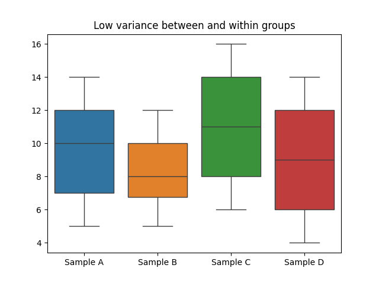
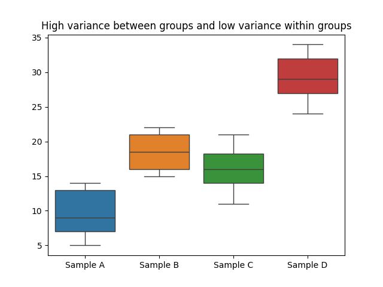
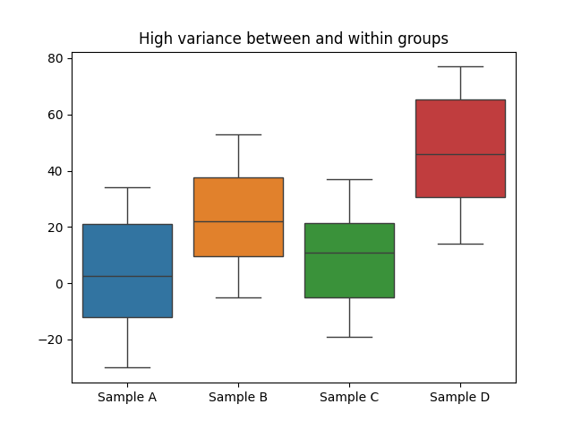

# Lesson 36 - ANOVA

        <head>

</head>

# Lecture 23: ANOVA
* __Note__: 

Resources for this lecture:

Remember:

## What is ANOVA?
Let's say you want to study a particular symptom to a respiratory disease by altitude. If you pick two locations at different altitudes, you can compare the mean measurements between your two samples using a 2-sample t-test.

But what if you want to study the effect at 3 or more different altitudes? ANOVA stands for __analysis of variance__. This test looks at multiple categories of a variable and compares the variance of each category to the other categories.

First, some quick terminology. We are trying to show that some measurement (response to a disease) varies from one category to another (altitude). The measurement (our dependent variable) will depend on the categories (our independent variable).

## Hypotheses
* H0:  There is no difference between the categories  ($\mu_1=\mu_2=\mu_3=\mu_4=\dots$)
* HA:  At least one mean is different than the others

* To demonstrate what we are doing, show the variance of and between variables by showing boxplots of 1 variable by 4 categories
    * Show all with low variance and nearly the same mean
        * Null Hypothesis 
        
    * Show again with low variance but very different means
        * High variance __between__ categories indicates categories are different - leans toward rejecting H0
        * Low variance between categories indicates categories are not different - leans toward failing to reject H0 
        
    * Show again with high variance and very different means
        * High variance __within__ catgories indicates categories are not different - leans toward failing to reject H0
        * Low variance within categories indicates categories are more different - leans toward rejecting H0 
        
    * Conclusion depends on both
        * To reject H0, we want both __high variance between categories__ and __low variance within categories__

## Measurements
The test statistic for ANOVA tests is known as the F-score. To calculate it, we need:
* Degrees of Freedom for variance between groups = Number of Categories - 1
* Degrees of Freedom for variance within groups = Total number of observations - Total number of groups

$$F = \frac{MSG}{MSE} = \frac{\text{Mean Square between Groups}}{\text{Mean Square Error}}$$

From now on, we are going to use these variables:
* $n$ is the number of observations
* $k$ is the number of categories

### MSE
Mean Square Error (MSE) is just variance!
$$MSE = \frac{\sum(x-\bar{x})^2}{df} = s^2$$

* df = degrees of freedom = n - k

For ANOVA tests, we just want to find the MSE ($s^2$) of the measurements __within__ each individual category.

### MSG
The Mean Square between Groups (MSG) is the variance of the data __between__ groups.
$$MSG = \frac{\sum n(\bar{x}_i - GM)}{df_G}$$

* $\bar{x}_i$ is the average of each individual category
* $GM$ is the Grand Mean, or the mean of all datapoint
* $df_G = k-1$ 

### Comparing MSG to MSE
Remember that MSG and MSE are both measures of variance.
* If the variance between any two observations is purely from randomness, then both MSG and MSE will be about the same.
    $$F=\frac{MSG}{MSE}\approx 1 \tag{no real dependence on categories}$$

* If the variance between any two categories is large, then MSG will be larger than MSE
    $$F=\frac{MSG}{MSE} > 1 \tag{indicates dependence on categories}$$
    * How much larger than 1? Depends on your level of significance

> High Octane example in worksheet

-----
# Homework
## Reading
* 7.5 Comparing many means with ANOVA

## Exercises
1. Exercise 7.35 from section () exercises
1. Exercise 7.38 from section () exercises 
    * For 7.38b, remember that there are two values for the degrees of freedom we need to consider
    * For 7.38c, assume a 5% level of significance
1. Exercise 7.39 from section () exercises
1. Exercise () from section () exercises
1. Exercise () from section () exercises
2. Exercise () from chapter () exercises